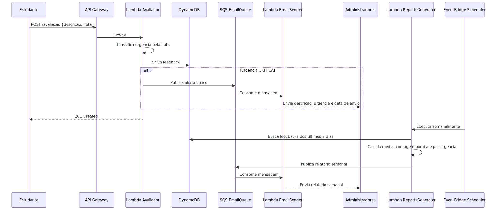

# Projeto: Qualidade dos cursos on-line - Tech Challenge Fase 04

## Equipe: Lista dos nomes e RMs dos alunos

| Nome | RM |
| --- | --- |
| Emerson Pereira da Silva | RM367268 |
| Luiz Octavio Tassinari Saraiva | RM367408 |

# 1. Introdução

## 1.1. Descrição do problema

Instituições de ensino precisam de uma forma simples e confiável para coletar feedbacks de alunos, identificar situações críticas com rapidez e acompanhar indicadores de qualidade ao longo do tempo. O desafio desta fase é implementar uma solução cloud serverless, com baixo custo operacional, rastreabilidade e facilidade de manutenção.

**Repositório:** https://github.com/eps364/tech-challenge-fase-04  
**Coleção Postman:** [docs/TechChallenge-Fase04.postman_collection.json](https://github.com/eps364/tech-challenge-fase-04/blob/main/docs/TechChallenge-Fase04.postman_collection.json)

## 1.2. Objetivo do projeto

Implementar uma plataforma serverless em AWS para:

- receber avaliações de alunos via API;
- validar e persistir feedbacks;
- classificar urgência automaticamente;
- notificar administradores em casos críticos;
- gerar relatório semanal consolidado.

### Funcionalidades principais

- Recebimento de feedback via endpoint HTTP
- Validação de payload (descrição e nota)
- Persistência em DynamoDB
- Alerta automático para avaliação crítica
- Geração de relatório semanal
- Monitoramento com CloudWatch e SNS

# 2. Arquitetura do Sistema

## 2.1. Visão Geral

A solução usa arquitetura serverless orientada a eventos, com API Gateway para entrada HTTP, Lambdas para regras de negócio, DynamoDB para armazenamento, SQS para desacoplamento, SES para envio de e-mails e EventBridge Scheduler para rotina semanal.

### Componentes principais

- **API Gateway HTTP API**: entrada das requisições externas.
- **Lambda Avaliador**: valida payload, classifica urgência, salva no DynamoDB e publica alerta crítico na fila.
- **DynamoDB (avaliacoes)**: armazenamento de feedbacks.
- **SQS EmailQueue**: fila principal para mensagens de e-mail.
- **SQS DLQ**: fila de mensagens com falha após tentativas.
- **Lambda EmailSender**: consome a fila e envia e-mails via SES.
- **Lambda ReportsGenerator**: consolida feedbacks da semana e publica mensagem de relatório.
- **EventBridge Scheduler**: dispara o relatório semanal.
- **CloudWatch + SNS**: logs, alarmes e notificações operacionais.

## 2.2. Diagrama de Arquitetura



## 2.3. Diagramas dos principais fluxos



# 3. Endpoints Principais

## 3.1 Endpoints da API

| Método | Endpoint | Permissão | Descrição |
|---|---|---|---|
| POST | /avaliacao | Público | Registra feedback, valida entrada, classifica urgência e persiste dados |
| POST | /avaliacoes | Público | Rota legada/compatibilidade apontando para o mesmo fluxo do avaliador |

### Regras de validação

- `descricao`: obrigatória, não pode estar em branco.
- `nota`: obrigatória, inteiro entre 0 e 10.

### Exemplo de request

```json
{
  "descricao": "A aula travou várias vezes e não consegui acompanhar o conteúdo.",
  "nota": 3
}
```

### Exemplo de response (sucesso)

```json
{
  "id": "uuid",
  "message": "Avaliação registrada com sucesso."
}
```

## 3.2 Chamadas internas e assíncronas

### Chamadas síncronas

| Fluxo | Objetivo |
| --- | --- |
| API Gateway -> Lambda Avaliador | Entrada HTTP de avaliação |
| Lambda Avaliador -> DynamoDB | Persistência do feedback |
| Lambda ReportsGenerator -> DynamoDB | Consulta dos últimos 7 dias |
| Lambda EmailSender -> SES | Envio de e-mail |

### Chamadas assíncronas

| Fluxo | Gatilho |
| --- | --- |
| Lambda Avaliador -> SQS email-queue | `AVALIACAO_CRITICA` quando nota <= 4 |
| EventBridge Scheduler -> Lambda ReportsGenerator | `cron(0 12 ? * MON *)` |
| Lambda ReportsGenerator -> SQS email-queue | `RELATORIO_GERADO` |
| SQS email-queue -> Lambda EmailSender | Consumo de alertas e relatórios |
| CloudWatch Alarms -> SNS monitoring-alerts | Alertas operacionais |

# 4. Eventos, Regras e Resiliência

- **Eventos de negócio**:
  - `AVALIACAO_CRITICA`
  - `RELATORIO_GERADO`
- **Classificação de urgência por nota**:
  - 0 a 4: CRÍTICA
  - 5 a 6: ALTA
  - 7 a 8: MÉDIA
  - 9 a 10: BAIXA
- **Resiliência**:
  - desacoplamento com SQS;
  - retentativa de consumo da fila;
  - DLQ para mensagens com falha recorrente;
  - alarmes para erros de Lambda e acúmulo na DLQ.

# 5. Banco de Dados e Infraestrutura

- **DynamoDB**: tabela `avaliacoes` com chave primária `id`.
- **SQS**: fila principal `email-queue` e DLQ `email-queue-dlq`.
- **SES**: envio de e-mails de alerta crítico e relatório semanal.
- **Infra como código**: Terraform em [infra/terraform](../infra/terraform).

## 5.1 Schema da tabela DynamoDB

Tabela: `avaliacoes`

| Campo | Tipo DynamoDB | Descrição |
| --- | --- | --- |
| `id` | `S` | Identificador único da avaliação (UUID) |
| `descricao` | `S` | Texto do feedback do aluno |
| `nota` | `N` | Nota recebida (0 a 10) |
| `urgencia` | `S` | Classificação da criticidade (`CRITICA`, `ALTA`, `MEDIA`, `BAIXA`) |
| `status` | `S` | Situação do ciclo de processamento |
| `createdAt` | `S` | Data/hora de criação em formato ISO 8601 |
| `updatedAt` | `S` | Data/hora de atualização em formato ISO 8601 |

Status esperados no ciclo:

- `CREATED`
- `EMAIL_REQUESTED`
- `REPORT_GENERATED`
- `EMAIL_SENT`
- `EMAIL_FAILED`

## 5.2 Contrato das mensagens SQS

As mensagens publicadas na fila seguem um contrato comum:

| Campo | Tipo | Descrição |
| --- | --- | --- |
| `type` | enum | Tipo do evento (`AVALIACAO_CRITICA` ou `RELATORIO_GERADO`) |
| `to` | string | Destinatário do e-mail |
| `subject` | string | Assunto do e-mail |
| `template` | string | Template utilizado na renderização |
| `payload` | object | Dados usados para montar o conteúdo final |

Exemplos oficiais de payload:

- [docs/API/email-avaliacao-critica.json](./API/email-avaliacao-critica.json)
- [docs/API/email-relatorio-gerado.json](./API/email-relatorio-gerado.json)

## 5.3 Variáveis de infraestrutura (Terraform)

Variáveis principais utilizadas nos ambientes:

### Obrigatórias

| Variável | Finalidade |
| --- | --- |
| `environment` | Ambiente (`dev` ou `prod`) |
| `aws_region` | Região AWS |
| `ses_from_email` | Remetente verificado no SES |
| `report_recipient_email` | Destinatário dos relatórios |
| `admin_alert_email` | Destinatário de alertas críticos |

### Opcionais (com default)

| Variável | Default | Finalidade |
| --- | --- | --- |
| `project_name` | `tech-challenge-fase-04` | Prefixo dos recursos |
| `dynamodb_table_name` | `avaliacoes` | Nome da tabela |
| `email_queue_name` | `email-queue` | Nome da fila principal |
| `email_dlq_name` | `email-queue-dlq` | Nome da DLQ |
| `report_schedule_expression` | `cron(0 12 ? * MON *)` | Agendamento do relatório semanal |
| `lambda_runtime` | `java17` | Runtime das Lambdas |
| `lambda_memory_size` | `512` | Memória das Lambdas (MB) |
| `lambda_timeout` | `30` | Timeout das Lambdas (segundos) |

## 5.4 Outputs relevantes do Terraform

O Terraform expõe outputs em dois formatos:

- **Consolidado**: `project_summary` em `infra/terraform/main.tf`.
- **Individualizado**: outputs separados em `infra/terraform/outputs.tf`.

Após `terraform apply`, os outputs mais úteis para operação e testes são:

- `api_gateway_url`
- `dynamodb_table_name`
- `email_queue_url`
- `email_dlq_url`
- `avaliador_lambda_name`
- `reports_generator_lambda_name`
- `email_sender_lambda_name`

No output consolidado `project_summary`, o campo da lambda de relatórios aparece como `reports_lambda_name`.

# 6. Execução e Testes

## 6.1 Execução local (LocalStack)

**Pré-requisito:** Docker instalado e em execução.

### Passo 1 — Configurar variáveis de ambiente

```bash
cp .env.example .env
```

Edite `.env` conforme necessário. Os valores padrão já funcionam para testes locais:

| Variável | Padrão | Observação |
|---|---|---|
| `AWS_REGION` | `us-east-1` | Região simulada |
| `SES_FROM_EMAIL` | `noreply@example.com` | Remetente simulado |
| `ADMIN_ALERT_EMAIL` | `admin@example.com` | Destinatário de alertas |
| `REPORT_RECIPIENT_EMAIL` | `admin@example.com` | Destinatário de relatórios |

### Passo 2 — Iniciar o LocalStack

```bash
./scripts/start-localstack.sh
```

> Aguarda o healthcheck do LocalStack antes de prosseguir. Equivale a `docker compose up -d localstack` + espera de prontidão.

### Passo 3 — Criar recursos e fazer deploy das Lambdas

```bash
./scripts/create-local-resources.sh
```

Este script executa em sequência:

- build e empacotamento dos JARs (`mvn clean package`);
- criação da tabela DynamoDB `avaliacoes`;
- criação das filas SQS `email-queue` e `email-queue-dlq` com RedrivePolicy;
- verificação da identidade SES;
- deploy (ou atualização) das três funções Lambda;
- mapeamento da fila SQS como event source do `email-sender`.

### Passo 4 — (Opcional) Validar a instalação

```bash
./scripts/validate-localstack.sh
```

Verifica tabela, filas, funções Lambda e executa um smoke test de invocação em cada Lambda.

### Passo 5 — Invocar as Lambdas manualmente

```bash
# Registrar uma avaliação (nota 3 → urgência CRÍTICA, dispara e-mail)
./scripts/invoke-avaliador-local.sh

# Gerar relatório semanal
./scripts/invoke-reports-local.sh

# Enviar e-mail diretamente (usando payload de exemplo)
./scripts/invoke-email-sender-local.sh
```

> O script `invoke-avaliador-local.sh` aceita um caminho de arquivo JSON como argumento opcional:
>
> ```bash
> ./scripts/invoke-avaliador-local.sh docs/API/avaliacao-request.json
> ```

### Passo 6 — Diagnosticar acesso via browser (WSL/Windows)

Se o LocalStack estiver funcionando no terminal mas nao conectar no `app.localstack.cloud`, rode:

```bash
bash ./scripts/diagnose-localstack-browser.sh
```

O script valida os endpoints locais, detecta WSL e imprime os comandos de `portproxy` para PowerShell (Administrador) quando necessario.

### Passo 7 — (Opcional) Interface grafica para DynamoDB

Para visualizar a tabela `avaliacoes` no browser:

```bash
docker compose up -d dynamodb-admin
```

Acesse: `http://localhost:8001`

> A interface `dynamodb-admin` cobre apenas o DynamoDB (nao os demais servicos do LocalStack).

## 6.2 Build e testes

```bash
mvn clean test
mvn clean package
```

Artefatos esperados:

- `lambdas/avaliador/target/avaliador.jar`
- `lambdas/reports-generator/target/reports-generator.jar`
- `lambdas/email-sender/target/email-sender.jar`

# 7. Qualidade, Segurança e Boas Práticas

- Arquitetura com separação de responsabilidades por função Lambda.
- IAM com menor privilégio por componente.
- Logs e métricas centralizados no CloudWatch.
- Alertas de monitoramento via SNS.
- Documentação de API em [docs/API/README.md](./API/README.md) e [docs/API/exemplos.md](./API/exemplos.md).

## 7.1 Estrutura dos módulos Java

O projeto segue separação por camadas e responsabilidades:

- `shared`: modelos, DTOs, serialização JSON, contratos de repositório/publicação, utilitários e exceções.
- `lambdas/avaliador`: entrada HTTP, validação do payload, cálculo de urgência e persistência.
- `lambdas/reports-generator`: consolidação semanal e publicação de mensagem de relatório.
- `lambdas/email-sender`: consumo SQS, renderização de templates e envio por SES.

Padrões utilizados:

- Repository Pattern (`AvaliacaoRepository`)
- Strategy para envio de e-mail (`SesEmailService` e `FakeEmailService`)
- Service Layer por domínio de função
- Factory para clientes AWS

## 7.2 Tratamento de erros

As exceções são tratadas por tipo para manter respostas previsíveis:

- `ValidationException`: erro de validação de entrada.
- `ProcessingException`: falhas de processamento de regra/serialização.
- `ConfigurationException`: configuração obrigatória ausente.

Comportamento esperado da API:

- erro de entrada: resposta 4xx com mensagem explicativa;
- erro inesperado: resposta 500 com mensagem genérica.

## 7.3 Estratégia de retentativa e DLQ

No consumo da fila de e-mails:

- a Lambda processa mensagens em lote (`batch size = 10`);
- falhas individuais são retornadas em `batchItemFailures`;
- a SQS tenta novamente mensagens falhas;
- após `maxReceiveCount = 3`, a mensagem é movida para a DLQ.

Esse desenho evita perda de mensagens e reduz impacto de falhas parciais.

## 7.4 Monitoramento detalhado

Monitoramento provisionado via Terraform:

- tópico SNS para alertas operacionais;
- alarmes CloudWatch para erros das três Lambdas;
- alarme para acúmulo de mensagens visíveis na DLQ;
- dashboard com visão de erros e fila de falhas.

Configuração padrão dos alarmes:

- threshold mínimo de 1 erro/mensagem;
- período de avaliação de 300 segundos.

## 7.5 Requisitos de envio no SES (produção)

Para envio real de e-mails em produção:

- o remetente (`SES_FROM_EMAIL`) deve estar verificado;
- em contas no sandbox do SES, destinatários podem precisar de verificação;
- para identidade de domínio, é necessário configurar DNS fora do Terraform.

# 8. Repositório do Código

Repositório oficial da entrega:

- [https://github.com/eps364/tech-challenge-fase-04](https://github.com/eps364/tech-challenge-fase-04)

# 9. Pipeline CI/CD

O projeto utiliza quatro workflows no GitHub Actions, cobrindo integração contínua, deploy para os ambientes dev e prod, e validação de GitFlow.

## 9.1 Workflows

| Workflow | Arquivo | Gatilho | Objetivo |
|---|---|---|---|
| CI | `ci.yml` | Push em qualquer branch e pull requests | Testes, build dos JARs e validação do Terraform |
| Deploy Dev | `deploy-dev.yml` | Acionamento manual (`workflow_dispatch`) | Build e deploy no ambiente dev via access keys |
| Deploy Prod | `deploy-prod.yml` | Push em `main` ou acionamento manual | Build e deploy em produção com OIDC |
| GitFlow Guard | `gitflow-guard.yml` | Pull requests (abertura, rebase, edição) | Bloqueia PRs fora do padrão de branches |

## 9.2 Fluxo de branches

O GitFlow Guard valida que apenas dois fluxos de PR são permitidos:

- `branch de trabalho` → `develop`
- `develop` → `main`

## 9.3 Diagrama do pipeline



## 9.4 Segredos necessários

### Deploy Dev

| Segredo | Descrição |
|---|---|
| `AWS_ACCESS_KEY_ID` | Chave de acesso AWS |
| `AWS_SECRET_ACCESS_KEY` | Chave secreta AWS |
| `SES_FROM_EMAIL` | E-mail remetente verificado no SES |
| `REPORT_RECIPIENT_EMAIL` | Destinatário dos relatórios |

### Deploy Prod

| Segredo / Variável | Descrição |
|---|---|
| `SES_FROM_EMAIL` | E-mail remetente verificado no SES |
| `REPORT_RECIPIENT_EMAIL` | Destinatário dos relatórios |
| `ADMIN_ALERT_EMAIL` | Destinatário dos alertas críticos |
| `TF_STATE_BUCKET` (var) | Bucket S3 para estado do Terraform |

> O deploy de produção usa OIDC para assumir a role `tech-challenge-fase-04-github-deploy`, eliminando a necessidade de access keys de longa duração.

# 10. Vídeo Explicativo da API

Vídeo explicativo detalhando a API, suas funcionalidades e como utilizá-la está disponível em:

URL: https://youtu.be/y822A41Wiko

# 11. Conclusão

A entrega da Fase 04 implementa um fluxo serverless completo para feedback acadêmico, com rastreabilidade de ponta a ponta: entrada HTTP, validação, persistência, notificação de casos críticos e relatório semanal automatizado. A solução atende aos requisitos funcionais e não funcionais do desafio com foco em simplicidade, clareza arquitetural e operação em cloud.

---

## Siglas e Significados

| Sigla | Significado |
|-------|-------------|
| API | Application Programming Interface |
| AWS | Amazon Web Services |
| DLQ | Dead Letter Queue |
| IaC | Infrastructure as Code |
| IAM | Identity and Access Management |
| SES | Simple Email Service |
| SQS | Simple Queue Service |
| SNS | Simple Notification Service |
| RF | Requisito Funcional |
| RNF | Requisito Não Funcional |
